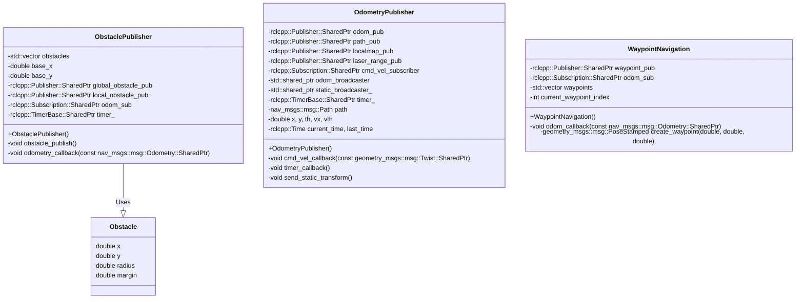

<p style="display: inline">
  <!-- Programming Language -->
  
  <!-- ROS 2 -->
  
  <!-- Geometry Messages -->
  
  <!-- Navigation Messages -->
  
  <!-- TF2 -->
  
</p>

## Functional Overview

## Requirements
### System Requirements
- OS : Ubuntu 22.04  
- ROS2 : Humble

## How To Use
### Execution Steps
```bash
cd ~/ros2_ws
source ~/ros2_ws/install/setup.bash
ros2 launch arcanain_simulator simulator.py
```

### Folder Structure

## Interface Table

### Input

### Output

### Internal Values

## Software architecture

### Class Diagram



### Flowchart

## Functional Requirements

## Detailed Design
